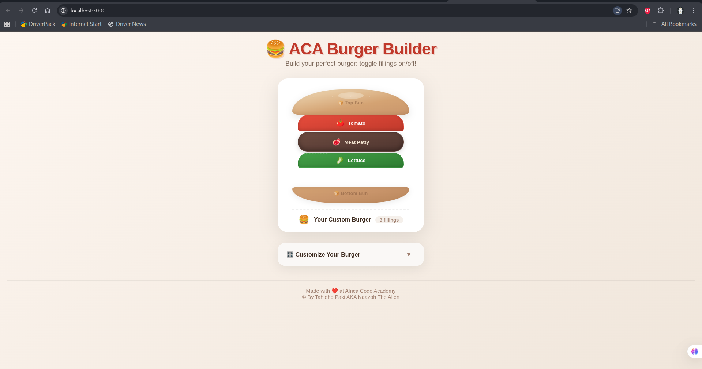

# 🍔 React Burger Builder

[](https://react-burger-ashen.vercel.app/)
[](https://github.com/tahleho3968/react-burger)
[](https://reactjs.org/)

> 🍔 A customizable burger builder built with React — toggle fillings on/off and build your perfect burger!



---

## 🌐 Live Demo

**View it live:** [https://react-burger-ashen.vercel.app/](https://react-burger-ashen.vercel.app/)

---

## 📋 Table of Contents

- [Overview](#overview)
- [Features](#features)
- [Tech Stack](#tech-stack)
- [Installation](#installation)
- [Available Scripts](#available-scripts)
- [Project Structure](#project-structure)
- [Components](#components)
- [Deployment](#deployment)
- [Submission](#submission)
- [Contributing](#contributing)
- [Acknowledgments](#acknowledgments)

---

## 📖 Overview

**React Burger Builder** is an interactive React application that allows users to build a custom burger by toggling various fillings on and off. This project was created as part of the **Africa Code Academy** Pair Programming & Clean Code module to practice:

- React component composition
- State management with `useState`
- Conditional rendering
- Clean Code principles
- Git/GitHub workflows
- Vercel deployment

---

## ✨ Features

### Core Features
| Feature | Description |
|---------|-------------|
| 🍞 **Bread Components** | Top and bottom bun with sesame seeds |
| 🥬 **7 Toggleable Fillings** | Tomato, Meat, Lettuce, Cheese, Onion, Pickle, Bacon |
| 🎛️ **Interactive Controls** | Checkboxes to toggle each filling on/off |
| ✅ **Select All / Deselect All** | Quick toggle all fillings at once |
| 📊 **Filling Counter** | Shows total number of active fillings |
| 📱 **Responsive Design** | Works on mobile, tablet, and desktop |
| 🎨 **Beautiful UI** | Gradients, shadows, hover animations |

### Additional Features
- Collapsible controls panel
- Visual feedback on hover
- Accessible checkboxes
- Clean Code principles applied

---

## 🛠️ Tech Stack

| Technology | Purpose |
|------------|---------|
| **React 19** | UI Framework |
| **TypeScript** | Type safety |
| **CSS3** | Styling (gradients, animations, flexbox) |
| **Create React App** | Project bootstrapping |
| **Git** | Version control |
| **GitHub** | Repository hosting |
| **Vercel** | Deployment & hosting |

---

## 🚀 Installation

### Prerequisites
- Node.js (v14 or higher)
- npm (v6 or higher)
- Git

### Clone the Repository

```bash
git clone https://github.com/tahleho3968/react-burger.git
cd react-burger
```

### Install Dependencies

```bash
npm install
```

### Start Development Server

```bash
npm start
```

Open [http://localhost:3000](http://localhost:3000) to view it in the browser.

---

## 📜 Available Scripts

| Script | Description |
|--------|-------------|
| `npm start` | Runs the app in development mode |
| `npm test` | Launches the test runner |
| `npm run build` | Builds the app for production to the `build` folder |
| `npm run eject` | Ejects from Create React App (one-way) |

---

## 📁 Project Structure

```
react-burger/
├── public/
│   ├── index.html
│   └── favicon.ico
├── src/
│   ├── App.tsx          # Main application with all components
│   ├── App.css          # All styles for the burger
│   ├── index.tsx        # Entry point
│   └── index.css        # Global styles
├── README.md
├── package.json
├── tsconfig.json
└── .gitignore
```

---

## 🧩 Components

### Bread Components
| Component | Description |
|-----------|-------------|
| `TopBread` | Top bun with sesame seeds |
| `BottomBread` | Bottom bun |

### Filling Components
| Component | Description |
|-----------|-------------|
| `Tomato` | Red tomato slice |
| `Meat` | Brown meat patty |
| `Lettuce` | Green lettuce |
| `Cheese` | Yellow cheese slice |
| `Onion` | Onion rings |
| `Pickle` | Green pickles |
| `Bacon` | Bacon strips |

### Main Components
| Component | Description |
|-----------|-------------|
| `Burger` | Main burger with state and controls |
| `App` | Root component with header and footer |

---

## 🚢 Deployment

### Deployed on Vercel

This app is deployed on **Vercel** with automatic deployments from the `master` branch.

**Live URL:** [https://react-burger-ashen.vercel.app/](https://react-burger-ashen.vercel.app/)

### Manual Deploy

```bash
# Build the project
npm run build

# Deploy to Vercel (requires Vercel CLI)
vercel --prod
```

---

## 📤 Submission

This project was submitted as part of the **Africa Code Academy — Pair Programming & Clean Code** module.

| Item | Link |
|------|------|
| **GitHub Repository** | [https://github.com/tahleho3968/react-burger](https://github.com/tahleho3968/react-burger) |
| **Live Deployment** | [https://react-burger-ashen.vercel.app/](https://react-burger-ashen.vercel.app/) |
| **Pull Request** | [https://github.com/tahleho3968/react-burger/pulls](https://github.com/tahleho3968/react-burger/pulls) |

### Submission Checklist

- [x] Code pushed to GitHub
- [x] App deployed on Vercel
- [x] All features working
- [x] Clean Code principles applied
- [x] README documentation complete

---

## 🤝 Contributing

This is a learning project, but contributions are welcome!

1. Fork the repository
2. Create a feature branch (`git checkout -b feature/amazing-feature`)
3. Commit your changes (`git commit -m 'Add amazing feature'`)
4. Push to the branch (`git push origin feature/amazing-feature`)
5. Open a Pull Request

---

## 🙏 Acknowledgments

- **Africa Code Academy** — For the learning opportunity
- **React Team** — For the amazing framework
- **Vercel** — For free hosting
- **All mentors and peers** — For guidance and feedback

---

## 📝 TIL Reflection

**What I learned from this project:**

1. React components are reusable building blocks
2. `useState` is essential for managing component state
3. Conditional rendering with `{show && <Component />}`
4. Clean Code principles (naming, structure, comments)
5. Git workflow for team collaboration
6. Deploying React apps on Vercel

---

## 📄 License

This project is open-source and available under the [MIT License](LICENSE).

---

**Made with ❤️ at Africa Code Academy © 2026**
